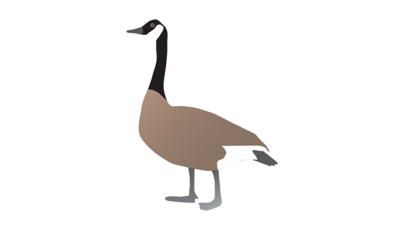
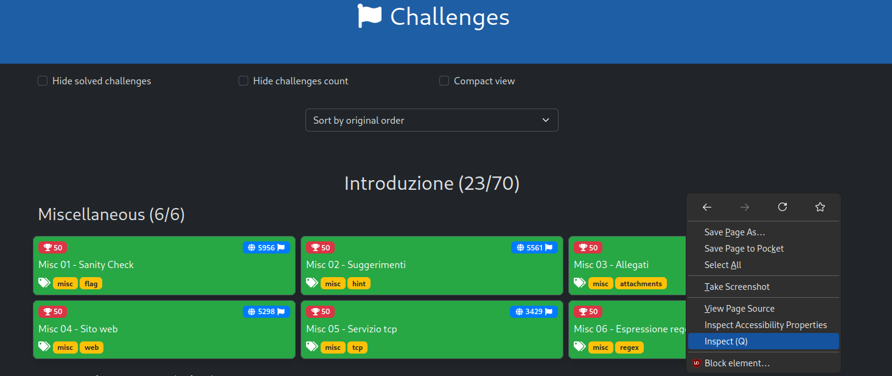
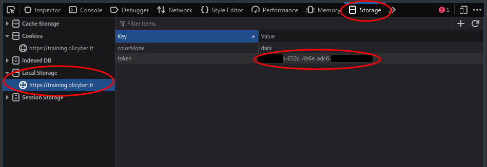

# OCA
> Olicyber Analyzer

<p align="center">
  
</p>

# Getting Started
pull and rename `template.config.json` to `config.json` and insert your [AUTH TOKEN](#auth-token)
```md
git clone https://github.com/utcq/oca.git
mv oca/template.config.json oca/config.json
```

I didn't implement anything to link oca to `bin` but you can still run it from the source folder:
```lua
./oca [Challenge URL]
./oca https://training.olicyber.it/challenges#challenge-224
```
<br>
<br>

---

<br>
<br>

# Files
## Downloads
All downloads and generated files are in `ocatmp/chall[ID]/`

<br>

## Config
The config is just a simple `config.json`. You can set API URLs, enabled plugins and challenges tags aliases.

<br>

> [!IMPORTANT]  
> You can also include extra-tag plugins
```json
"binary": {
  "plugins": ["pwn.format_dump"]
}
```

<br>
<br>

---

<br>
<br>

# HOW-TO
## Auth Token
Go to the [Training Platform](training.olicyber.it), login. Then use the dev-tools to view the local storage and get your token.



